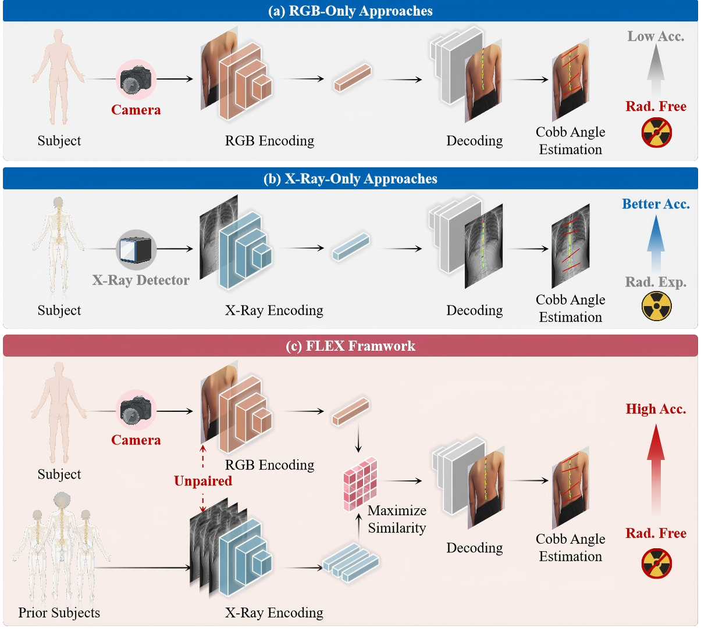
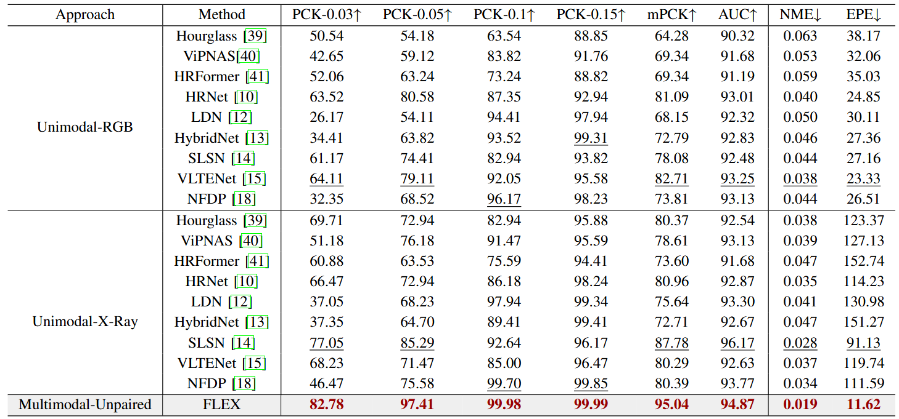
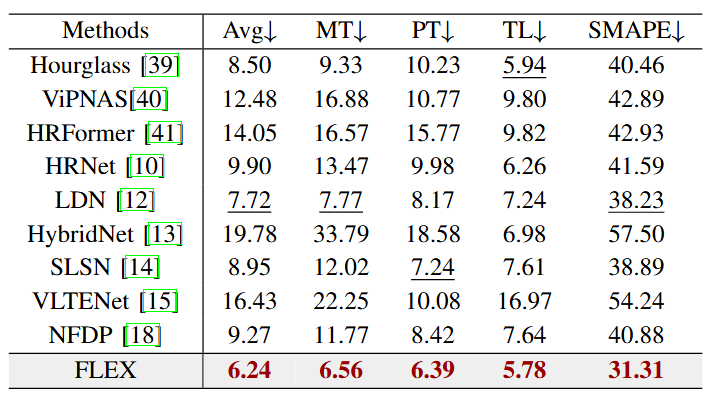
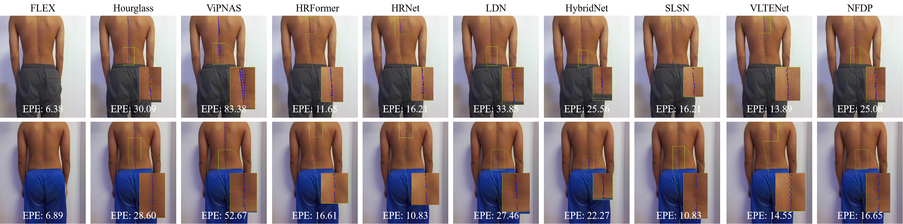

# Radiation-Free Scoliosis Cobb Angle Estimation via X-Ray Guided Unpaired RGB Learning

More details of this project will be released soon.

weights: &nbsp;

## Network Architecture

Comparison of scoliosis assessments. (a) RGB-Only: a non-invasive, cost-effective solution, but with limited accuracy due to reliance on surface imaging. (b) X-Ray-only: provides high accuracy for skeletal landmark detection but incurs radiation exposure and higher costs. (c) FLEX: achieves clinical-grade accuracy while remaining radiation-free and cost-efficient, bridging the gap between safety and precision.

## Data Description
### Dataset Name: SCO dataset

Challenge: X-ray Image-Guided RGB Vertebral Landmark Detection and Scoliosis Cobb Angle Estimation

The SCO dataset is the first cross-modal landmark detection dataset for AIS. It is created by recruiting 1001 adolescent participants from Peking Union Medical College Hospital and capturing both RGB visible-light images and X-ray images, resulting in 1001 pairs of cross-modal images (a total of 2002 images). The RGB images are captured at a resolution of 1920×1080 pixels, while the X-ray images have resolutions ranging from 2000×5000 to 3000×8000 pixels, providing high resolution for detailed representation of spinal anatomical structures. The images are obtained under standardized laboratory conditions, with subjects in a full-spine standing position, which accurately reflects the biomechanical characteristics of the spine under weight-bearing conditions and offers a physiological basis for clinical evaluation.

## Benchmark

 Quantitative comparison of vertebral landmark detection performance on the SCO dataset. The performance of three approaches covering unimodal-RGB, unimodal-X-ray and multimodal-unpaired are reported. The performance of FLEX is highlighted in gray, and the best performance in landmark detection is recorded in red.

Quantitative comparison of Cobb angle estimation performance on the SCO dataset.

## Visualization
Qualitative visualization of landmark position errors comparing FLEX with other methods. The red dots represent the ground-truth positions, the green dots represent the predicted positions, and the blue dashed line represents the error distance.

Qualitative visualization of the Cobb angle estimation of FLEX compared to other methods. The endplate used for estimating the MT, PT, and TL are represented in red.

